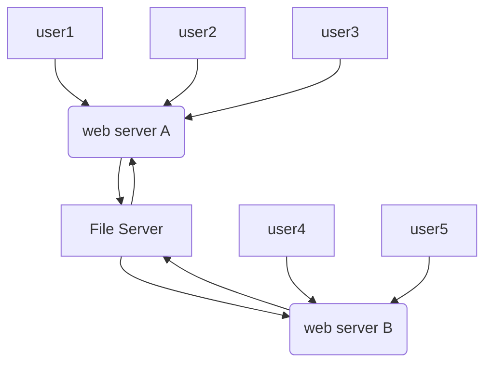

# _LiFE_
## _**Li**ght and **F**ast **F**ile **E**xplorer_

```mermaid
  graph TD
    u1[user1] --> W1(web server A)
    
    u2[user2] --> W1(web server A)
    u3[user3] --> W1(web server A)
    
    W1 --> F1[File Server]
    F1 --> W1
    F1 --> W2
    W2 --> F1
    
    u4[user4] --> W2(web server B)
    u5[user5] --> W2(web server B)
```
