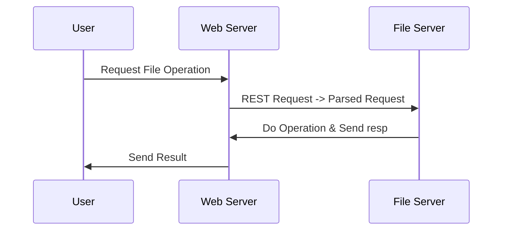

# _LiFE_
## _**Li**ght and **F**ast **F**ile **E**xplorer_

___________________________________

___________________________________
## *Many More Detailes about each Process*  
### [File Server Manual](file_server/README.md)  
### [Web Server Manual](web_server/README.md)  
____________________________________
