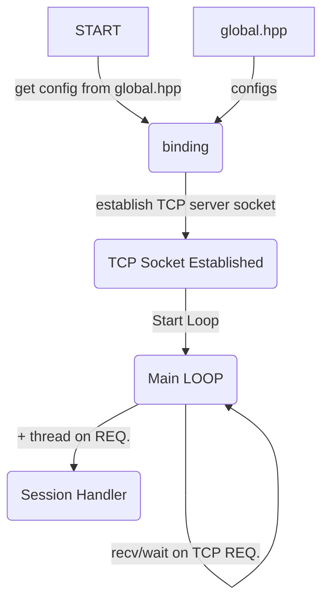
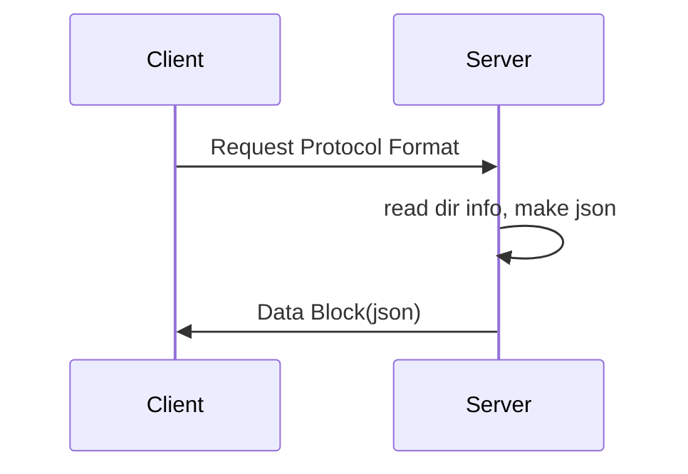

## network_file_explorer
-----------------------------------------------------
### Brief Manual
_____________________________________________________
  ### Server Process


  ### Request Protocol Format
  #### Over TCP Stack  
| Protocol Value(field names) | Protocol Type | Dir. Size            |      Directory       | Data Size               |        Data          |
| --------------------------- | ------------- | -------------------- | -------------------- | ----------------------- | -------------------- |
| FIELD SIZE ==========>      | 1 / byte      | 4 / uint32           | Dir. Size / string   | 4 / uint32              | Data Size / byte(s)  |
| 0:REQ_TYPE_DIR_INFO_DEPTH_2 | 0             | DirSize in uint32    | DirName in string    | 0                       | -                    |
| 1:REQ_TYPE_DOWNLOAD_FILE    | 1             | DirSize in uint32    | DirName end with '/' | FileNameSize in uint32  | FileName with no path|
| 2:REQ_TYPE_COPY_FILE        | 2             | SrcNameSize in uint32| SrcFileName FullPath | DstNameSize in uint32   | DstFileName FullPath |
| 3:REQ_TYPE_MOVE_FILE        | 3             | SrcNameSize in uint32| SrcFileName FullPath | DstNameSize in uint32   | DstFileName FullPath |
| 4:REQ_TYPE_DELETE_FILE      | 4             | DirSize in uint32    | DirName end with '/' | FileNameSize in uint32  | FileName with no path|
| 5:REQ_TYPE_RENAME_FILE      | 5             | SrcNameSize in uint32| SrcFileName FullPath | DstNameSize in uint32   | DstFileName FullPath |
| 6:REQ_TYPE_DIR_INFO_DEPTH_1 | 6             | DirSize in uint32    | DirName in string    | 0                       | -                    |
  
    
  ### Session Handler: response scenario for each protocol type
#### Short Example
```
EX) Request for information in pi's home directory:  
READ) 6  |    8 bytes  | /  h  o  m  e  /  p  i  | 0           | -  
HEX)  06 | 08 00 00 00 | 2F 68 6F 6D 65 2F 70 69 | 00 00 00 00 | -  
```

```
EX) Response from server example
DATA)
[
  {
    "auth" : "rwxr-xr-x",
    "is_dir" : "1",
    "name" : "test",
    "size" : "4096",
    "time" : "2021-10-18 10:46",
    "type" : ""
  },
  {
    "auth" : "rw-r--r--",
    "is_dir" : "",
    "name" : ".vimrc",
    "size" : "226",
    "time" : "2022-04-14 03:14",
    "type" : ""
  }
]
```
#### Data Formats  
**Data Block**  
[ 4 bytes - Size ] [ Size * bytes ]
| Fields | Data Size | Data |
| ------ | --------- | ---- |
| Size | 4 bytes   | Data Size * byte |
| Format | uint32    | bytes |
  
**ACK Block**  
| Field | ACK Block |
| ----- | --------- |
| Size  | 4 bytes |
| all bytes = 0x00 |  
  
  
**Protocol: 0:REQ_TYPE_DIR_INFO_DEPTH_2, 6:REQ_TYPE_DIR_INFO_DEPTH_1**



**Protocol: 1:REQ_TYPE_DOWNLOAD_FILE**
```mermaid
sequenceDiagram
    Client->>Server: Request Protocol Format

    Server->>Server: read file data
    
    Server->>Client: Data Block(bytes)    
````  

**Protocol: 2:REQ_TYPE_COPY_FILE, 3:REQ_TYPE_MOVE_FILE, 4:REQ_TPYE_DELETE_FILE, 5:REQ_TYPE_RENAME_FILE**
```mermaid
sequenceDiagram
    Client->>Server: Request Protocol Format

    Server->>Server: process file i/o internally
    
    Server->>Client: ACK Block
```
  
  
